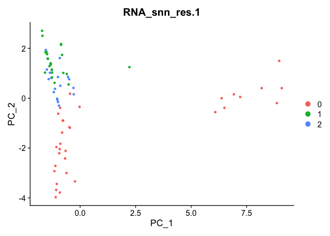
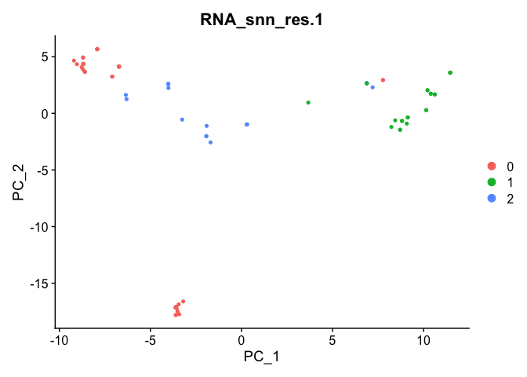

# scennep: Single-Cell Nearest-Neighbor Pseudobulking

<!-- badges: start -->

[](https://www.tidyverse.org/lifecycle/#experimental)
<!-- [](https://lifecycle.r-lib.org/articles/stages.html#stable) -->
<!-- badges: end -->

`scennep` computes pseudobulk expression profiles for each cell in a
single-cell RNA-seq (scRNA-seq) dataset based on its nearest neighbors.
This approach aggregates the expression values of a cell and its top
nearest neighbors. The purpose is to rescue zeros caused by dropouts and
transcriptional bursting. `scennep` has many use cases - it was
developed to improve the integration of scRNA-seq and cytometry data.

## Article

(TODO) A preprint is soon available for `scennep`.

Please cite with `citation("scennep")`

## Installation

### Dependencies

`scennep` works with both `Bioconductor` objects and `Seurat`.

Install your preferred framework or both:

``` r
# Seurat
install.packages("Seurat")

# Bioconductor
if (!require("BiocManager", quietly = TRUE))
    install.packages("BiocManager")
BiocManager::install(c("SingleCellExperiment", "scater", "scuttle", "scran", "igraph"))
```

### Install from GitHub

``` r
remotes::install_github("shdam/scennep")
```

## Vignettes

(TODO) View use case vignettes on [Biosurf](https://biosurf.org/).

## Usage

`scennep` will work on a `matrix`, `Seurat`, and `SingleCellExperiment`
object. If a matrix is provided, please choose an option for
`as = c("seurat", "bioc")`.

This example usage uses a tiny simulated dataset as a `Seurat` object.

See `?scennep` for the full configuration.

``` r
library(Seurat)
#> Loading required package: SeuratObject
#> Loading required package: sp
#> 'SeuratObject' was built under R 4.4.0 but the current version is
#> 4.4.3; it is recomended that you reinstall 'SeuratObject' as the ABI
#> for R may have changed
#> 'SeuratObject' was built with package 'Matrix' 1.7.0 but the current
#> version is 1.7.3; it is recomended that you reinstall 'SeuratObject' as
#> the ABI for 'Matrix' may have changed
#> 
#> Attaching package: 'SeuratObject'
#> The following objects are masked from 'package:base':
#> 
#>     intersect, t
library(scennep)
data("pbmc_small")

# Current PCA plot
Seurat::DimPlot(pbmc_small, reduction = "pca", group.by = "RNA_snn_res.1")
```



``` r

# Compute pseudobulk expression profiles
pbmc_small <- scennep(
    pbmc_small,
    nn_count = 5 # Number of nearest neighbors - default: 20 - 5 is just for this tiny example
    )
#> Using the top 11 pcs for the SNN
#> Building SNN graph with k = 5
#> Pseudobulking each cell with its 5 nearest neighbors
#> Adding pseudobulked expression data to assay 'scennep'
#> Warning: Layer counts isn't present in the assay object; returning NULL
pbmc_small
#> An object of class Seurat 
#> 460 features across 80 samples within 2 assays 
#> Active assay: scennep (230 features, 230 variable features)
#>  1 layer present: data
#>  1 other assay present: RNA
#>  2 dimensional reductions calculated: pca, tsne
```

``` r

# PCA of scennep output
pbmc_small <- Seurat::ScaleData(pbmc_small)
#> Centering and scaling data matrix
pbmc_small <- Seurat::RunPCA(pbmc_small, verbose = FALSE)
#> Warning in svd.function(A = t(x = object), nv = npcs, ...): You're computing
#> too large a percentage of total singular values, use a standard svd instead.
#> Warning: Number of dimensions changing from 19 to 50
Seurat::DimPlot(pbmc_small, reduction = "pca", group.by = "RNA_snn_res.1")
```



## Report issues

If you have any issues or questions regarding the use of `scennep`,
please do not hesitate to raise an issue on GitHub. In this way, others
may also benefit from the answers and discussions.
